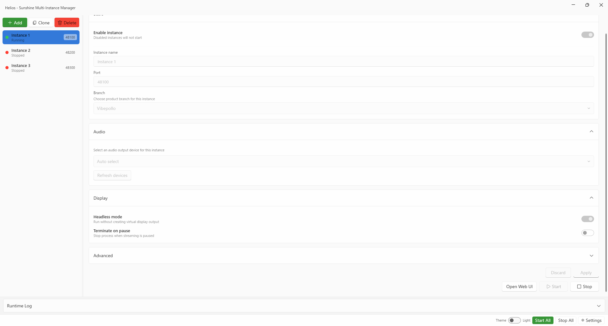
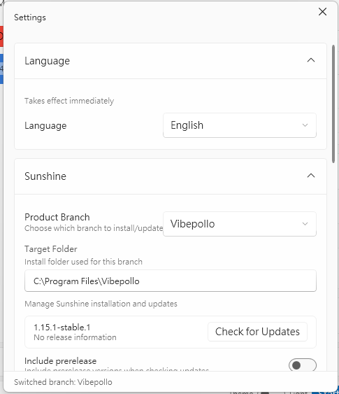

# Sunshine Multi-Instance Manager

A modern WPF application for managing multiple [Sunshine](https://github.com/LizardByte/Sunshine) (and its forks) streaming instances on a single Windows machine.

**Language / README**: English | [繁體中文](README.zh-TW.md) | [简体中文](README.zh-CN.md) | [日本語](README.ja.md)

## Features

- **Multi-Instance Management** - Create, edit, clone, and delete independent streaming instances, each with its own port, configuration, and credentials.
- **Supported Branches** - Works with [Sunshine](https://github.com/LizardByte/Sunshine), [Apollo](https://github.com/ClassicOldSong/Apollo), [Vibeshine](https://github.com/Nonary/vibeshine), and [Vibepollo](https://github.com/Nonary/Vibepollo).
- **Service-Based Launch** - Instances are launched via a background Windows Service running as LocalSystem, enabling full desktop capture including UAC prompts and the Windows login screen.
- **Auto-Start on Boot** - Windows Task Scheduler integration to launch the manager at user logon.
- **Display Change Detection** - Automatically restarts instances when display configuration changes (resolution, monitor count), with smart debouncing and UAC-awareness.
- **Per-Instance Audio Routing** - Assign a specific audio output device to each instance.
- **Volume Synchronization** - Monitors the system default audio volume and syncs it to each instance's configured audio sink in real time.
- **Auto-Update** - Check for and install updates from GitHub Releases for any supported branch, with pre-release toggle and progress tracking.
- **Modern UI** - Fluent/WinUI-styled interface with dark/light theme support, system tray integration, and real-time log viewer.

## Requirements

- **OS**: Windows 10 / 11 (x64)
- **Runtime**: [.NET 8.0 Desktop Runtime (x64)](https://dotnet.microsoft.com/download/dotnet/8.0)
- **Privileges**: Administrator (required for service registration and instance launching)
- **Sunshine**: At least one supported branch installed (Sunshine, Apollo, Vibeshine, or Vibepollo)

## Installation

1. Download `SunshineMultiInstanceManagerSetup.exe` from the latest release.
2. Run the installer and follow the on-screen instructions.
3. Launch `SunshineMultiInstanceManager.exe` as administrator.

On first launch, the application will automatically:
- Register the **Spawner Service** as a Windows Service (LocalSystem).
- Start the service and begin managing instances through it.

No manual service setup is required.

## Usage

1. **Add an instance** - Click the add button, select the product branch, set a name and port.
2. **Configure** - Adjust audio device, headless mode, extra arguments, and other options per instance.
3. **Start** - Enable the instance and click Start (or Start All). The Spawner Service launches each instance with full system privileges.
4. **Connect** - Use [Moonlight](https://moonlight-stream.org/) or any compatible client to connect to the configured port.
5. **Web UI** - Click the link icon next to an instance to open its web configuration panel.

## Screenshots

### Main Window



### Settings



## Build from Source

```bash
# Build the application
dotnet build src/SunshineMultiInstanceManager.App/SunshineMultiInstanceManager.App.csproj

# Publish (includes Spawner Service automatically)
dotnet publish src/SunshineMultiInstanceManager.App/SunshineMultiInstanceManager.App.csproj -p:PublishProfile=win-x64-fd
```

The publish output at `publish/win-x64-fd/` includes the main application and the `service/` subdirectory containing the Spawner Service.

## Architecture

```
SunshineMultiInstanceManager.App      WPF desktop application (UI + local control)
SunshineMultiInstanceManager.Core     Shared library (process management, config, audio, display, updates)
SunshineMultiInstanceManager.Spawner  Windows Service (runs as SYSTEM, launches instances via Named Pipe commands)
```

The App communicates with the Spawner Service over a Named Pipe. The Service launches Sunshine instances using a SYSTEM token assigned to the user's interactive session, which allows capturing the secure desktop (UAC and login screen) - the same capability as a standard Sunshine service installation.

## Known Limitations

> **Vibeshine / Vibepollo installer conflict**: While this manager is designed to let multiple Sunshine-based branches coexist, the Vibeshine and Vibepollo installers will require you to uninstall any other Sunshine-based branch before proceeding — installation cannot continue unless you agree. If you install a Vibe-series branch first and then install Sunshine or Apollo afterward, they can temporarily coexist. However, the next time you update the Vibe-series branch, the installer will once again require removal of the other branches.

## Disclaimer

This project was built primarily for personal use. Functionality is not guaranteed to work in all environments or configurations. Use at your own risk.

## Inspiration

This project was inspired by [Apollo Fleet Launcher](https://github.com/drajabr/Apollo-Fleet-Launcher), a multi-instance launcher for Apollo. Sunshine Multi-Instance Manager expands on the concept with a broader range of supported branches, a service-based architecture for secure desktop capture, and additional features such as audio routing and auto-update.

## AI Disclosure

This project was developed with the assistance of AI, including OpenAI Codex and Anthropic Claude.

## License

This project is licensed under the [GNU General Public License v3.0](LICENSE).
